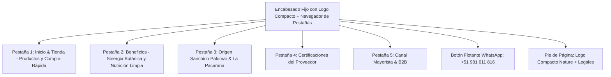

# Sistema de Diseño & Especificación Técnica: XIEMBRA

> **Marca:** XIEMBRA &middot; *Hijos de la Tierra*  
> **Categoría:** *Functional Snacks* de Cacao Nativo 65% & Café de Especialidad  
> **Origen Geográfico:** Parque Nacional del Café, Sanchirio Palomar, Valle de Chanchamayo (Junín, Perú)  
> **Contacto Oficial:** `+51 981 011 816` | `xiembra.peru@gmail.com`  
> **Registro Sanitario:** DIGESA G100441/N-KCEPAR | **RUC:** 20486021773 / 20616165365  

---

## 1. Propósito del Codebase & Objetivos del Producto

### 1.1 Misión Técnica
Este repositorio alberga la plataforma web oficial de **XIEMBRA**, construida como una aplicación estática autónoma de alto rendimiento (*zero-dependency runtime*), optimizada para despliegue sin fallas (0 errores 404) en **Vercel** y visualización en cualquier dispositivo móvil o de escritorio.

### 1.2 Objetivos de Negocio
1. **Conversión D2C a Nivel Nacional:** Canalizar pedidos directos de consumidores en Lima Metropolitana y todas las provincias del Perú mediante un calculador interactivo de pedidos enlazado a la API de WhatsApp.
2. **Captación de Canal Mayorista / B2B:** Capturar clientes corporativos (cafeterías de especialidad, biomarkets, hoteles y tiendas gourmet) mediante formularios de solicitud de lista de precios preferenciales.
3. **Narrativa de Origen & Trazabilidad:** Exponer la procedencia exclusiva del grano de café cosechado en el **Parque Nacional del Café en Sanchirio Palomar** (1,200 – 1,900 m s. n. m.) y la alianza con más de 2,300 familias caficultoras (*Chanchamayo Highland Coffee SAC*).
4. **Preservación de Marca y Mascota:** Integrar a **La Pacarana** (*Dinomys branickii*) como guardiana de la biodiversidad y el logotipo oficial en su versión compacta de alta resolución.

---

## 2. Archivos Críticos del Codebase

| Archivo | Rol en el Proyecto | Descripción y Relevancia |
| :--- | :--- | :--- |
| [`index.html`](file:///c:/Users/Usuario/Documents/Xiembra/index.html) | **Página de Producción (Bundle)** | Archivo autónomo que contiene el HTML completo con todos los recursos gráficos (imágenes, logotipos y mascotas) incrustados en cadenas Base64. Garantiza carga instantánea sin requerir peticiones de red adicionales para imágenes. |
| [`template_clean.html`](file:///c:/Users/Usuario/Documents/Xiembra/template_clean.html) | **Fuente de la Verdad (Template)** | Archivo fuente estructurado en **ASCII estricto (7-bit)** con entidades HTML para todos los acentos y símbolos (`&eacute;`, `&aacute;`, `&ntilde;`, `&#127477;&#127466;`, etc.). Previene cualquier corrupción por codificación en sistemas Windows o servidores web. |
| [`build_standalone.ps1`](file:///c:/Users/Usuario/Documents/Xiembra/build_standalone.ps1) | **Script de Compilación** | Lee `template_clean.html`, procesa el mapeo de imágenes relativas desde `images/`, genera las cadenas Base64 y escribe sincrónicamente el resultado en `index.html`, `dist/index.html`, `site/index.html` y `public/index.html`. |
| [`contexto.md`](file:///c:/Users/Usuario/Documents/Xiembra/contexto.md) | **Memoria de Marca** | Documento rector que especifica la propuesta de valor, los aliados estratégicos, el catálogo de productos con precios PVP y B2B, y los lineamientos del manual de identidad corporativa. |
| [`vercel.json`](file:///c:/Users/Usuario/Documents/Xiembra/vercel.json) | **Configuración de Despliegue** | Define `cleanUrls: true`, cabeceras de CORS `Access-Control-Allow-Origin: *` y políticas de caché inmutable a 1 año (`max-age=31536000, immutable`) para `/fonts/` y `/images/`. |
| [`images/`](file:///c:/Users/Usuario/Documents/Xiembra/images) | **Directorio de Activos Web** | Contiene los renders optimizados de producto (`mockup100gcaja_opt.jpg`, `mockup20g1_opt.jpg`, `CafeXiembra.jpg`), el fondo de portada panorámica (`Fondo portada web.jpeg`), los logos compactos de 2250px y la mascota oficial transparente (`pacarana_mascot_clean.png`). |
| [`fonts/`](file:///c:/Users/Usuario/Documents/Xiembra/fonts) | **Archivos Tipográficos Físicos** | Archivos OpenType y TrueType originales (`forrest-bold.otf`, `ut-marmalade-bold.ttf`, `Sequel Sans`), complementados en web mediante Google Fonts. |
| [`1. Identidad de Marca y Diseno/`](file:///c:/Users/Usuario/Documents/Xiembra/1.%20Identidad%20de%20Marca%20y%20Diseno) | **Activos de Marca Oficiales** | Archivos vectoriales editables (.ai, .pdf), renders del manual de marca en JPG, logos transparentes en alta definición y tipografías corporativas. |
| [`2. Documentos Corporativos/`](file:///c:/Users/Usuario/Documents/Xiembra/2.%20Documentos%20Corporativos) | **Documentación de Empresa** | Presentaciones de negocio (pitch deck, inversión), brochure corporativo, investigación de mercado (Focus Group) y especificaciones técnicas de packaging. |

---

## 3. Identidad Visual & Tokens de Diseño (Design System)

El diseño de XIEMBRA se rige por la regla de armonía cromática **60-30-10** del manual de marca:

### 3.1 Paleta de Color Oficial

```
┌───────────────────────────────────────────────────────────────┐
│                      SISTEMA CROMÁTICO                        │
├────────────────────────────────┬──────────────────────────────┤
│ brand-campo       (#006148)    │ 50% Base Institucional       │
│ brand-nature      (#CBEC8A)    │ 30% Frescura & Botánica      │
│ brand-lemon       (#FFFC88)    │ 10% Acento & Luminosidad     │
│ brand-crema       (#FFFCD2)    │ 10% Fondo Cálido & Textura   │
├────────────────────────────────┼──────────────────────────────┤
│ brand-campoDark   (#004734)    │ Fondos Secundarios Oscuros   │
│ brand-campoDarker (#062319)    │ Fondo Hero & Footer Profundo │
│ brand-marfil      (#FAF8F5)    │ Fondo Base de Página (Light) │
│ brand-arena       (#F2EDE4)    │ Contenedores & Pill Nav      │
│ brand-charcoal    (#111C16)    │ Tipografía Principal         │
│ brand-muted       (#4D6257)    │ Párrafos & Metadatos         │
│ brand-dorado      (#C5A059)    │ Acentos de Altitud y Calidad │
└────────────────────────────────┴──────────────────────────────┘
```

### 3.2 Tipografía y Jerarquía Web

Para garantizar **0 errores de renderizado** y soporte completo de glifos en español (`á, é, í, ó, ú, ñ, ¡, ¿`), la interfaz utiliza:

* **Titulares de Marca (`.font-brand-title`):**
  * Familia: `'Outfit'`, `'Plus Jakarta Sans'`, sans-serif.
  * Peso: `700` (Bold) a `900` (Black).
  * Tracking: `-0.02em` a `-0.03em` para un acabado editorial moderno.
* **Subtítulos y Acentos (`.font-brand-display`):**
  * Familia: `'Outfit'`, `'Plus Jakarta Sans'`, sans-serif.
  * Peso: `600` (SemiBold) / `700` (Bold).
* **Cuerpo de Texto y Formularios (`body`, `p`, `input`):**
  * Familia: `'Plus Jakarta Sans'`, sans-serif.
  * Pesos: `400` (Regular), `500` (Medium), `600` (SemiBold), `700` (Bold).
  * Interlineado: `leading-relaxed` (1.625) para máxima legibilidad.
* **Protección Anti-Mojibake:**
  * En el código fuente HTML se aplican estrictamente **entidades HTML** (`&eacute;`, `&aacute;`, `&iacute;`, `&oacute;`, `&uacute;`, `&ntilde;`, `&#127477;&#127466;` para la bandera de Perú, `&#9733;` para estrellas).
  * Los textos dinámicos en JavaScript emplean códigos de escape Unicode (`\u00E9`, `\u00A1`, etc.).
  * Verificación binaria: **0 bytes no-ASCII** en el marcado base.

### 3.3 Sombras y Elevaciones

* `shadow-glow-nature`: `0 0 35px rgba(203, 236, 138, 0.35)` (destacado de botones de acción y tarjetas premium).
* `shadow-glow-campo`: `0 12px 35px rgba(0, 97, 72, 0.25)` (botones primarios verde campo).
* `shadow-premium`: `0 20px 45px -10px rgba(6, 35, 25, 0.12)` (tarjetas flotantes de producto).

---

## 4. Arquitectura de Información & Estructura de la Página

La web no sigue una plantilla genérica de secciones lineales; su navegación está orquestada como una **máquina de estados por pestañas (*Single-Page Tabbed Architecture*)**:



### 4.1 Pestaña 1: Inicio & Tienda (`#tab-inicio`)
* **Hero Panorámico Inmersivo:** Utiliza [`images/xiembra_portada_hero_panoramica.jpeg`](images/xiembra_portada_hero_panoramica.jpeg) como fondo completo de pantalla (`min-h-[780px]`). Presenta la propuesta de valor con botones directos: *"Comprar Ahora"* (scroll suave a los productos) y *"Conocer Beneficios"* (navega a la pestaña de beneficios).
* **Cintillo Marquee Continuo:** Animación infinita destacando el origen, cacao nativo y envíos a nivel nacional.
* **Guía de Compra en 3 Pasos:** Explicación visual paso a paso de lo fácil que es ordenar (`1. Elige tu formato`, `2. Ajusta cantidades`, `3. Recibe vía WhatsApp directo`).
* **Catálogo de Productos Oficiales (3 Formatos):**
  * **Bolsita Individual 20g:** Formato On-The-Go a S/ 6.90.
  * **Caja Gourmet 100g:** Producto estrella con la ilustración de La Pacarana a S/ 24.00.
  * **Café de Especialidad 100g:** Grano arábica de altura cosechado en Sanchirio Palomar a S/ 28.00.
* **Calculadora de Pedidos en Vivo (`#checkout-box`):**
  * Controles de incremento/decremento de cantidades.
  * Selector geográfico para Lima Metropolitana y Provincias del Perú con cálculo de flete en tiempo real.
  * Botón de cierre directo que envía el pedido pre-formateado al WhatsApp oficial **`+51 981 011 816`**.
* **Garantías de Confianza:** Sellos visuales de Envíos a todo el Perú, Pago Seguro y 100% Garantía de Origen.

### 4.2 Pestaña 2: Beneficios & Ciencia Botánica (`#tab-beneficios`)
* **Sinergia Botánica Funcional:** Explica el balance entre la teobromina del cacao bitter 65% y la cafeína natural de altura de Sanchirio Palomar (energía sostenida sin taquicardia ni picos de ansiedad).
* **Comparativa de Valor:** Tabla de contraste frontal *"Golosina Convencional de Kiosko"* vs. *"Sinergia Botánica XIEMBRA"*.
* **4 Ingredientes Limpios (*Clean Label*):** Desglose de licor de cacao, manteca de cacao, panela orgánica y café arábica de especialidad sin conservantes ni aditivos químicos.
* **Call To Action Directo:** Botón *"Ir a Comprar Productos"* que redirige al usuario a la tienda en la portada.

### 4.3 Pestaña 3: Origen Sanchirio Palomar & La Pacarana (`#tab-origen`)
* **Epicentro Geográfico:** Detalla la localización en el **Parque Nacional del Café en Sanchirio Palomar** (distrito de San Luis de Shuaro / Chanchamayo, Junín).
* **Métricas Reales:** 1,900 m s. n. m. de altitud máxima, alianza con más de 2,300 familias y 40,000 hectáreas de bosque bajo sombra.
* **Mascota Oficial La Pacarana:** Showcase con [`images/xiembra_mascota_pacarana_transparente.png`](images/xiembra_mascota_pacarana_transparente.png) flotando suavemente, explicando el simbolismo del *Dinomys branickii* (sombrero campesino, pala y taza de café caliente).

### 4.4 Pestaña 4: Certificaciones de Origen (`#tab-certificados`)
Logotipos vectoriales en SVG de los sellos de la cadena productiva:
1. **USDA Organic** (Estándar orgánico de EE. UU.)
2. **EU Organic / Euro-Leaf** (Normativa ecológica de la Unión Europea)
3. **Fair Trade** (Comercio justo)
4. **Rainforest Alliance** (Cultivo bajo dosel de sombra y conservación de fuentes de agua)
5. **BioEM Japón** (Microorganismos eficaces para regeneración biológica de suelos)
6. **IMO Control Latinoamérica** (Trazabilidad y auditoría de planta, Registro N° 25-11576PE)

### 4.5 Pestaña 5: Canal B2B & Mayorista (`#tab-b2b`)
* Formulario estructurado para dueños de cafeterías, tiendas saludables y supermercados.
* Captura de Nombre de Empresa, RUC, Ciudad y Formato de Interés.
* Envío de cotización comercial directa a Roger Kirby Espinoza Alarcón vía WhatsApp oficial.

---

## 5. Activos de Marca y Especificaciones Técnicas

| Recurso Gráfico | Archivo en Disco | Dimensiones / Formato | Uso en la Interfaz |
| :--- | :--- | :--- | :--- |
| **Logo Compacto Oscuro** | [`images/xiembra_logo_compacto_verde_campo.png`](file:///c:/Users/Usuario/Documents/Xiembra/images/xiembra_logo_compacto_verde_campo.png) | 1637 × 756 px (PNG Transparente) | Encabezado principal sobre vidrio claro (`#FAF8F5`) y cajón móvil. |
| **Logo Compacto Claro** | [`images/xiembra_logo_compacto_verde_nature.png`](file:///c:/Users/Usuario/Documents/Xiembra/images/xiembra_logo_compacto_verde_nature.png) | 1637 × 756 px (PNG Transparente) | Pie de página sobre fondo verde bosque (`#062319`). |
| **Mascota La Pacarana** | [`images/xiembra_mascota_pacarana_transparente.png`](file:///c:/Users/Usuario/Documents/Xiembra/images/xiembra_mascota_pacarana_transparente.png) | 1071 × 1351 px (PNG Transparente) | Distintivo flotante en portada y ficha de origen en Tab 3. |
| **Portada Principal** | [`images/xiembra_portada_hero_panoramica.jpeg`](file:///c:/Users/Usuario/Documents/Xiembra/images/xiembra_portada_hero_panoramica.jpeg) | 1536 × 1024 px (JPEG Panorámico) | Fondo de pantalla completo de la sección Hero. |
| **Caja 100g Pacarana** | [`images/xiembra_producto_caja_100g_pacarana.jpg`](file:///c:/Users/Usuario/Documents/Xiembra/images/xiembra_producto_caja_100g_pacarana.jpg) | 1000 × 1000 px (JPEG Optimizado) | Tarjeta de producto ancla en catálogo. |
| **Bolsita 20g** | [`images/xiembra_producto_bolsita_20g.jpg`](file:///c:/Users/Usuario/Documents/Xiembra/images/xiembra_producto_bolsita_20g.jpg) | 515 × 1000 px (JPEG Optimizado) | Tarjeta de producto impulso en catálogo. |
| **Café Especialidad** | [`images/xiembra_producto_cafe_especialidad_100g.jpg`](file:///c:/Users/Usuario/Documents/Xiembra/images/xiembra_producto_cafe_especialidad_100g.jpg) | 1672 × 941 px (JPEG Optimizado) | Tarjeta de café de especialidad en catálogo. |

---

## 6. Procedimiento de Build y Verificación Continua

Para compilar y sincronizar cualquier cambio en la aplicación, se debe ejecutar:

```powershell
powershell -ExecutionPolicy Bypass -File build_standalone.ps1
```

Este comando verifica la integridad de los activos, codifica las imágenes a Base64 e impacta simultáneamente:
* `index.html` (raíz del proyecto)
* `dist/index.html` (entorno de despliegue)

Criterio de aceptación técnica: **0 bytes no-ASCII en el archivo HTML compilado**, garantizando interoperabilidad universal en cualquier servidor o navegador.
